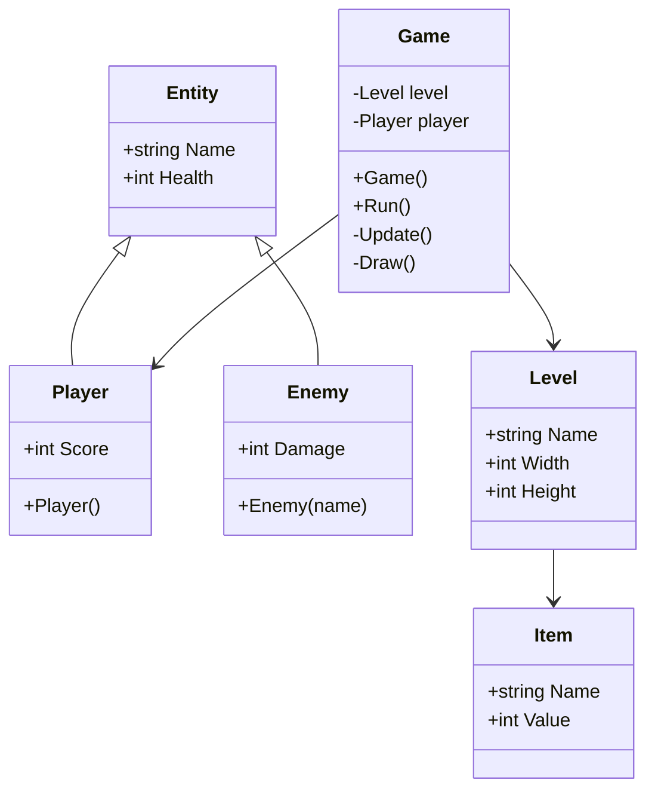

# Class Diagram

```mermaid
classDiagram
    class Entity {
        +string Name
        +int Health
    }

    class Player {
        +int Score
        +Player()
    }

    class Enemy {
        +int Damage
        +Enemy(name)
    }

    class Game {
        -Level level
        -Player player
        +Game()
        +Run()
        -Update()
        -Draw()
    }

    class Level {
        +string Name
        +int Width
        +int Height
    }

    class Item {
        +string Name
        +int Value
    }

    Entity <|-- Player
    Entity <|-- Enemy
    Game --> Level
    Game --> Player
    Level --> Item
```
